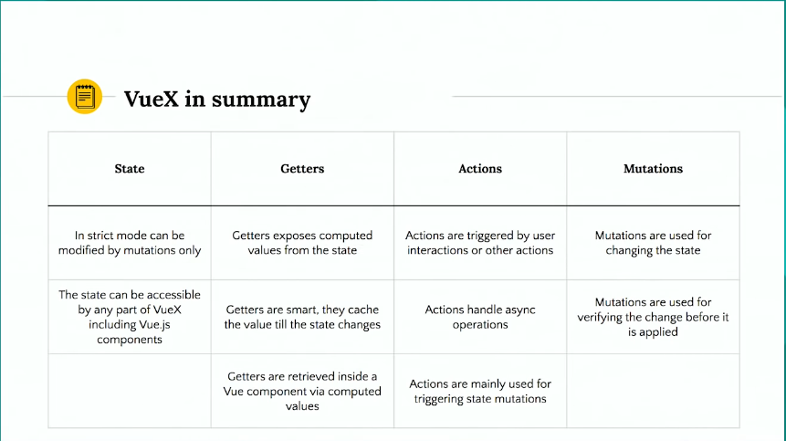

# Vuex Application Structure
In this project I have divided the store.js file into different type structure

## What is Vuex?
Vuex is a state management pattern + library for Vue.js applications. It serves as a centralized store for all the components in an application, with rules ensuring that the state can only be mutated in a predictable fashion. It also integrates with Vue's official devtools extension to provide advanced features such as zero-config time-travel debugging and state snapshot export / import.



## Documentation
You can find out more info how to configure your app here: https://vuex.vuejs.org/installation.html

## Installation
For Installation I would recommend using vue ui:

  | :warning: Make Sure you are on the right folder before installing! |
  | --- |

```npm
vue ui
```

### Examples
More example to look at here:
https://github.com/vuejs/vuex